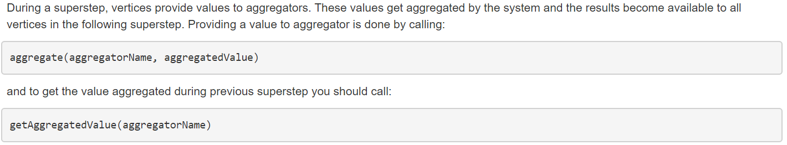
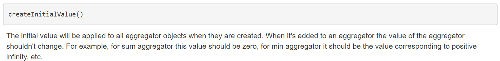

1. Vertex:
   a. setValue()
   b. getValue()
   c. voteHalt()
2. Aggregator:
   a. aggregator(aggregator name, value)
   b. getAggregatedValue(aggregateName)
3. Superstep: getSuperStep()
4. Messag: sendMessageToAllEdges(vertex, value)

注意: 输出结果都是从vertex中读取, 所以要记得将输出的值setvalue

# 数据模型

1. Class Vertex: https://giraph.apache.org/apidocs/org/apache/giraph/graph/Vertex.html

   - getValue(): get a vertex value
   - setValue(V value)
   - voteTohalt(): 节点进入休眠

2. aggregator: https://giraph.apache.org/aggregators.html

   - 

   - get/send values
   - 
   - set value

3. basic aggregator: https://giraph.apache.org/apidocs/org/apache/giraph/aggregators/BasicAggregator.html

# Count_vertex

1. 此处使用的是: Class IntSumAggregator:https://giraph.apache.org/apidocs/org/apache/giraph/aggregators/IntSumAggregator.html
   - 
2. runner.java
   - setComputationClass(impl.class)
   - setMasterComputationClass()
3. MasterCompute.java中
   - 设置master中的aggregator name: COUNT_VERTEX	
   - 注册aggregator: registerAggregator(COUNT_VERTEX, IntSumAggregator.class)
4. CountVertexImpl.java中类ContVertexImpl, 重载函数compute:
   - 给aggregator发送value: aggregate(COUNT_VERTEX, value)
   - 获取aggregator的值: getAggregatedValue(COUNT_VERTEX) --> setValue
   - 第二轮superstep时, 令vertex休眠: voteHalt()

# Pagerank

1. 根据计算模型

   - giraphConf.setComputationClass(impl.class)

2. Impl

   - 需要每一轮超步内, 将计算出的rank值存储在节点中
   - 根据公式: 
     - 第一轮的每个节点不需要相邻节点的rank值, 其值计算: 1/N(N:所有节点的数量), 并发送
     - 其它一轮每个节点: 需要知道相邻节点rank值: iterable迭代收到的消息
     - 每一轮每个节点: 
       - 需要将其rank值通知相邻节点, -->sendMessageToAllEdges(vertex, value)
       - 需要判断是否需要进入休眠: vertex.voteHalt(); (所有节点进入休眠之后任务结束)

3. 其他函数: 

   - getSuperstep(): 获得当前处于第几轮超步(从0开始)

4. 总结: 

   - 第一轮超步: 不需要遍历消息, 直接计算本节点的rank值-->setValue->发消息

   - 其他轮超步: 遍历消息-->计算本届点的rank值, setValue-->发消息;
   - 判断结束条件, 令节点休眠: vertex.voteHalt()
   - 全部节点休眠, 任务结束.