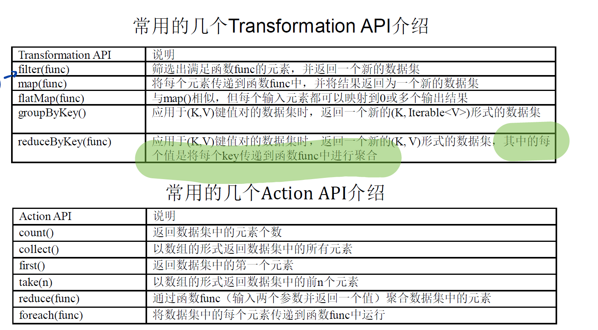

官网: https://spark.apache.org/docs/latest/rdd-programming-guide.html#rdd-operations

## 语法



## 常用

1.  工具: 

   - 生成随机数: 

     ```java
     double lower = -1;
     double upper = 1;
     double n = ThreadLocalRandom.current().nextDouble(lower, upper);
     ```

   - 变量: 

     ```java
     Double.MAX_VALUE;
     ```

2. class: 

   -  JavaRDD\<Object\>: 生成一个供并行化操作的dataset;

   - Tuple:

     ```java
     Tuple value;
     // 获取值
     value._1;
     value._2;
     ```

   - Vector:

     ```java
     Vector point;
     // 获取值
     point.toArray()[idx];
     ```

   - Iterator: 

     ```java
     // 获取长度
     Iterator.size();
     ```

   - Broadcast:

     ```java
     // 声明
     Broadcast<Map<Long, String>> persons;
     // 获取值
     Map<Long, String> map = persons.getvalue();
     ```

   - Map:

     ```java
     // 判断是否包含
     map.containsKey(key);
     // 获取值
     map.get(key);
     map.entrySet().iterator();
     // 修改值
     map.put(key, value);
     ```
     
   
3. 操作: 

   - map:

     ```java
     .map(
     (TYPEIN PARAMETERSIN) -> (Transformation of parameter));
     ```

   - join: 

     ```java
     // 声明
     JavaPairRDD<Long, Tuple<String,String>> joinRDD = personRDD.join(orderRDD);
     // 获取值
     joinRDD.values();
     ```

   
