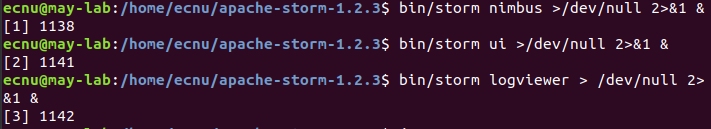
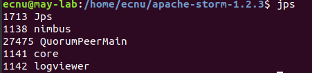
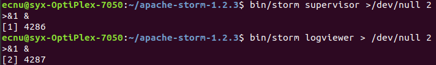
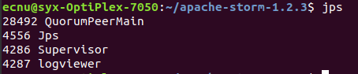
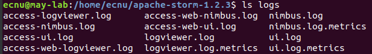
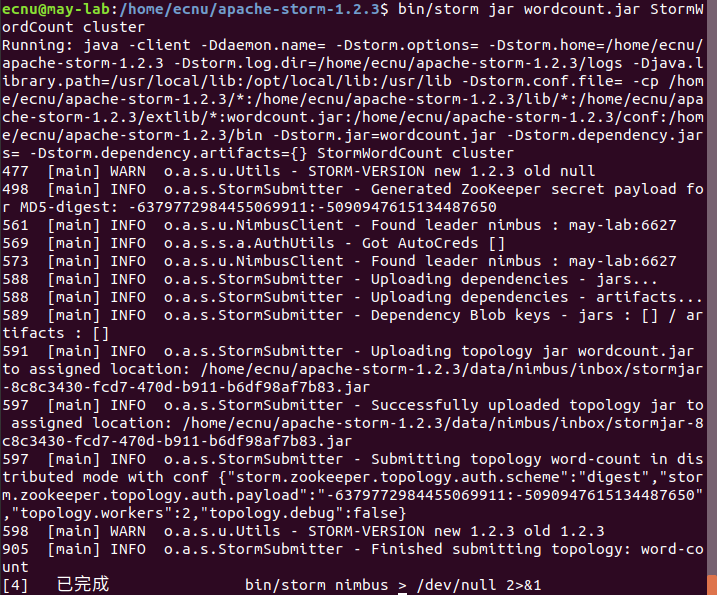
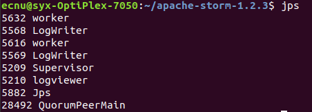
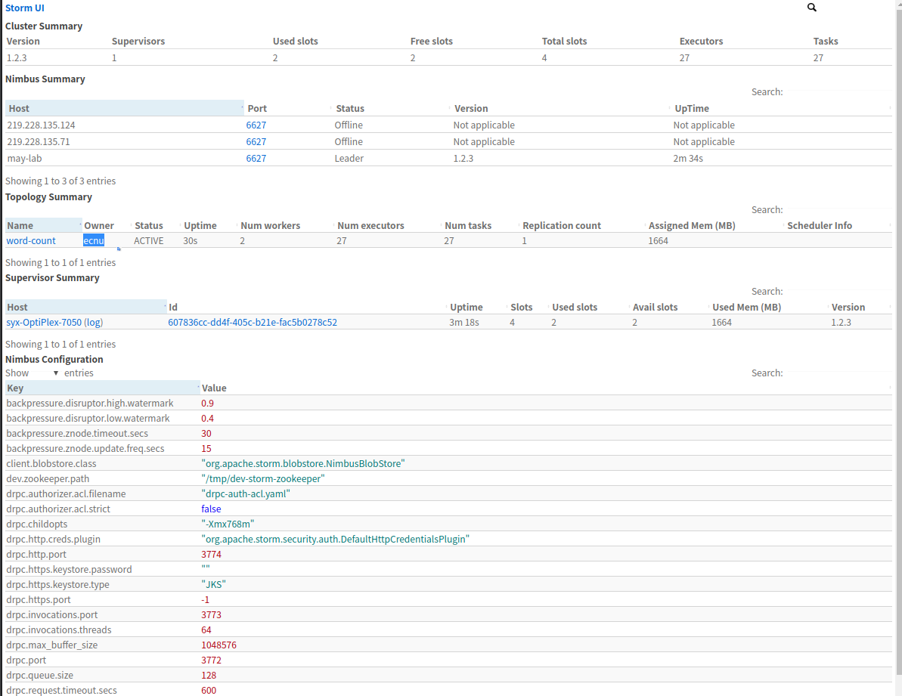
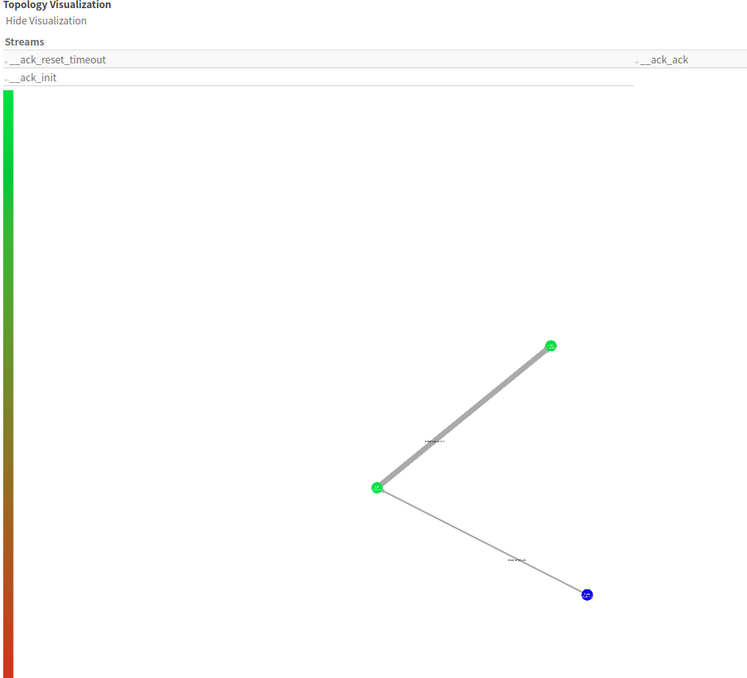

- ### 分布式

  - #### Storm部署与程序运行

    主节点上启动：

    

    查看主节点进程：

    

    从节点上启动：

    从节点查看进程：

    查看Storm服务日志信息：

    

    运行Storm应用程序Wordount

    运行过程中jps查看进程信息，可以明显地看到worker节点多出来一个worker进程和其对应的一个日志进程LogWriter：

    

    同时，在web ui界面也查看服务信息：

    

    可以看到应用程序已经运行了，它的执行状态是ACTIVE，共有两个worker进程，27个Task；

    topology visualization：
  
    最后 `./bin/storm kill word-count`终止应用程序。