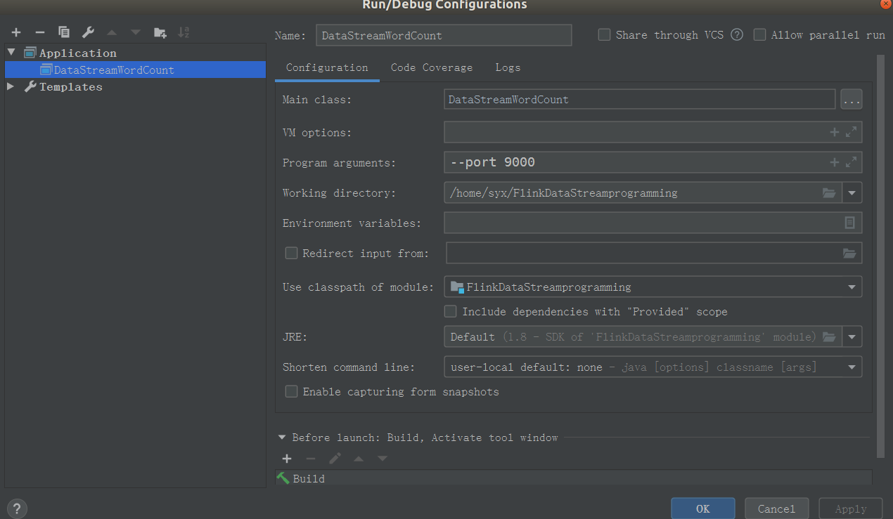
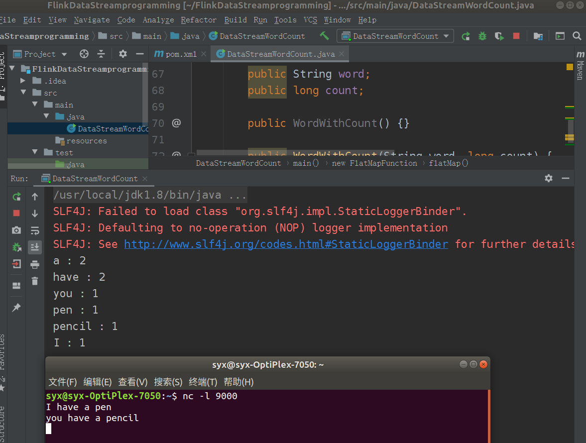

# 华东师范大学数据科学与工程学院实验报告

| **课程名称：分布式模型与编程**         | **年级：2017**       | **上机实践成绩**：                                       |
| -------------------------------------- | -------------------- | -------------------------------------------------------- |
| **指导教师**：**徐辰**                 | **姓名**：**熊双宇** | **学号**：**10174102103**                                |
| **上机实践名称**：**Flink部署与编程 ** |                      | **上机实践日期**：**2019.11.24-2019.12.04【第13-14周】** |
| **上机实践编号：实验四**               | **组号**：**11**     | **上机实践时间**：**18:00-19:30***                       |

# 一. 实验目的

- 学习Flink的部署，理解Flink的体系架构
- 练习Flink DataStream的编程
- 深入理解Flink批流融合的工作机制

# 二. 实验任务

- [Storm部署]()【第10周】：单机集中式、单机伪分布式（在个人用户下独立完成）、分布式（多位同学新建一个相同的用户，例如ecnu，协作完成）
- [Storm编程]()【第10周】

# 三. 使用环境

1. Ubuntu18.04
2. flink-1.7.2
3. hadoop-2.9.2

# 四. 实验过程

## Flink 部署

### 1. 单机集中式部署

#### 1.1 准备工作

* 操作系统的安装详情参考: [Prepare.md](../Hadoop Deployment/Prepare.md)

* 安装Flink：去[官网](https://flink.apache.org/downloads.html)下载Flink压缩包，并解压。本此实验以flink-1.7.2-bin-hadoop28-scala_2.11.tgz为例。

	```shell
	>>> tar -zxvf flink-1.7.2-bin-hadoop28-scala_2.11.tgz
	>>> mv flink-1.7.2 ~
	```

#### 1.2 运行Flink DataStream程序

*   使用shell运行DataStream程序

    * 本地模式启动Scala-Shell

      

    *   在 `scala>` 后输入 scala 代码

        ```scala
        val textstreaming=senv.fromElements("a a b b c")
        val countsstreaming=textstreaming.flatMap { _.toLowerCase.split("\\W+") } .map { (_, 1) }.keyBy(0).sum(1)
        countsstreaming.print()
        senv.execute()  // 提交作业
        ```

        运行结果如下图所示： 

        

*   通过提交 jar 包运行DataStream程序

    flink不可以直接提交jar包运行，首先仍需要在 `终端1` 本地模式启动Scala-Shell之后另起终端，提交jar包

    * 默认模式提交

      `终端2` 中启动socket服务作为数据源

      

      `终端3` 中提交jar包

      

        向 `终端2` 中输入数据进行wordcount计算，在 `终端1` 运行结果如下图所示:

      

        在运行过程中另起一个终端执行 `jps` 查看进程，此时会出现 CliFrontend 进程, 计算运行结束后该进程消失

      

        DataStream程序终止的两种方法

        * 在[WebUI](localhost:8081)上`cancel`

        * 命令行终止`flink cancel JobID`，`JobID`通过`flink list`查询

          

          

        **注：杀掉客户端进程是无法停止程序的**

    * detached模式提交

      `终端2` 中启动本地服务

      

      `终端3` 中提交程序jar包

      

      程序提交完毕后会自动退出客户端，不再打印作业进度等信息

      向 `终端2` 中输入数据进行wordcount计算，在 `终端1` 运行结果如下图所示:

      

      在运行过程中另起一个终端执行 `jps` 查看进程，此时不会出现 CliFrontend 进程

      

      DataStream程序终止的两种方法

      - 在[WebUI](localhost:8081)上`cancel`

      - 命令行终止`flink cancel JobID`，`JobID`通过`flink list`查询

        

        

    **注：杀掉客户端进程是无法停止程序的**

    **输入`:q`退出Scala-shell**

    


### 2. 单机伪分布式部署

#### 2.1 准备工作

*  完成[单机集中式部署](#1-单机集中式部署)
#### 2.2 修改Flink配置

*   更改配置文件flink-conf.yaml
    ```shell
    >>> vim ~/flink-1.7.2/conf/flink-conf.yaml
    ```
    
    修改如下：
    
    ```yaml
    jobmanager.rpc.address: localhost  #配置JobManager进行RPC通信的地址，使用默认即可
    jobmanager.rpc.port: 6123          #配置JobManager进行RPC通信的端口，使用默认即可
    rest.port: 8081  # 客户端访问端口与可视化端口，使用默认值即可
    taskmanager.numberOfTaskSlots: 2  #配置TaskManager 提供的任务 slots 数量大小，默认为1
    taskmanager.memory.preallocate: false  #配置是否在Flink集群启动时候给TaskManager分配内存，默认不进行预分配，这样在我们不适用flink集群时候不会占用集群资源
    parallelism.default: 1  # 配置程序默认并行计算的个数，默认为1
    ```
    
    `注意：flink-conf.yaml中配置key/value时候在“:”后面需要有一个空格，否则配置不会生效。注释与配置项不要在同一行`
    
    以下还有一些非常重要的配置值（需要调节时更改，本例中不做更改）：
    
    每个JobManager（jobmanager.heap.mb）的可用内存量
    
    每个TaskManager（taskmanager.heap.mb）的可用内存量
    
    每台机器的可用CPU数量（taskmanager.numberOfTaskSlots）
    
    集群中的CPU总数（parallelism.default）
    
    临时目录（taskmanager.tmp.dirs）  #内存不够用时，写入到taskmanager.tmp.dirs指定的目录中。如果未显式指定参数，Flink会将临时数据写入操作系统的临时目录。
    
*   更改配置文件slaves
    ```shell
    >>>vi ~/flink-1.7.2/conf/slaves
    # 文件中默认内容为localhost，本例中不做修改
    ```

#### 2.3 启动Flink服务

*   启动命令

    

*   查看进程，验证是否成功启动服务
    * 使用jps命令，因为在此单机伪分布式部署模式下，该节点既充当JobManager角色，又充当TaskManager角色，故该节点上会有两个进程：一个JobManager进程和一个TaskManager进程。若同时出现JobManager进程和TaskManager进程，则表明配置成功以及启动成功。

      

      `在standalone模式下，Jobmanager的进程名为StandaloneSessionClusterEntrypoint`

*   在 http://localhost:8081 (端口号为在配置文件`flink-conf.yaml`中设置的 `rest.port`) 确认flink是否正常运行
  
    
    因为本例在flink-conf.yaml中设置taskmanager.numberOfTaskSlots的值为2，故每个TaskManager有2个slot。

#### 2.4 运行Flink DataStream程序

- 使用shell运行DataStream程序

  - 远程模式启动Scala-Shell

    

  - 在 `scala>` 后输入 scala 代码

    运行结果如下图所示： 

    

    另起终端中打开log目录下的out文件会显示flink的执行结果

    

    **输入`:q`退出Scala-Shell**

- 通过提交 jar 包运行DataStream程序

  - 默认模式提交

    `终端1` 中启动本地服务

    

    `终端2` 中提交程序jar包

    

    `终端3` 中打开log目录下的out文件会显示flink的执行结果

    向 `终端1` 中输入数据进行wordcount计算，在 `终端3` 运行结果如下图所示:

    

    在运行过程中另起一个终端执行 `jps` 查看进程
    此时会出现 CliFrontend 进程, 计算运行结束后该进程消失

    

    DataStream程序终止的两种方法

    - 在[WebUI](localhost:8081)上`cancel`

      

      

    - 命令行终止`flink cancel JobID`，`JobID`通过`flink list`查询

    **注：杀掉客户端进程是无法停止程序的**

  - detached模式提交

    `终端1` 中启动本地服务

    

      `终端2` 中提交程序jar包

    

    程序提交完毕后会自动退出客户端，不再打印作业进度等信息

    `终端3` 中打开log目录下的out文件会显示flink的执行结果

    

      向 `终端1` 中输入数据进行wordcount计算，在 `终端3` 运行结果如下图所示:

    

      在运行过程中另起一个终端执行 `jps` 查看进程
      此时不会出现 CliFrontend 进程

    

      DataStream程序终止的两种方法

      - 在[WebUI](localhost:8081)上`cancel`

    - 命令行终止`flink cancel JobID`，`JobID`通过`flink list`查询

      **注：杀掉客户端进程是无法停止程序的**

#### 2.5 停止Flink服务

*   停止命令 
    ```shell
    >>> ~/flink-1.7.2/bin/stop-cluster.sh
    ```
    

*   查看进程，验证是否成功停止服务

     * 若成功停止，JobManager进程和TaskManager进程应消失。

### 3. 分布式部署

#### 3.1 准备工作

请确认是否已完成以下内容:

- 有至少两台的服务器每台机器上的已完成 [Prepare.md](../Hadoop Deployment/Prepare.md)
- 服务器之间实现[免密登录](../Basic/ssh.md)
- 在其中一台机器上完成[单机集中式部署](#1-单机集中式部署)
- 已完成 [HDFS v2 分布式部署](../Hadoop Deployment/HDFS v2-deployment.md#2-分布式部署)并启动（由于程序的输入输出需要）

#### 3.2 修改配置文件

*   更改配置文件flink-conf.yaml
    ```shell
    >>> vi ~/flink-1.7.2/conf/flink-conf.yaml
    ```
    
    主要的修改内容有：

    ```yaml
    jobmanager.rpc.address: 219.228.135.207  #配置JobManager进行RPC通信的地址
    ```
    
    说明：此处的Master应用实际配置过程中Master的ip地址代替；其余部分配置信息在伪分布式部署已经列出，按需配置。
    
*   更改配置文件slaves
  
    `vi conf/slaves`
    文件中默认内容为localhost，本例中修改为：
    
    ```vim
    219.228.135.207 
    219.228.135.42
    ```
    
    说明：此处的Slave应用实际配置过程中Worker的ip地址代替
    
*   将配置好的Flink同步到其他节点
    ```shell
    scp -r flink-1.7.2 219.228.135.42:/home/ecnu/
    ```
#### 3.3 启动flink服务

*   启动命令
    ```shell
    ~/flink-1.7.2/flink-1.7.2/bin/start-cluster.sh
    ```
    
*   查看进程，验证是否成功启动服务
    * 因为在此分布式部署模式下，Master节点充当Master角色，各Slaves节点充当Worker角色，故在Master节点上会存在一个JobManager进程，各Slaves节点上会存在一个TaskManager进程。分别在Master和Slaves上使用jps命令，若在Master上出现StandeloneSessionClusterEntrypoint进程，且在Slaves上出现TaskManagerRunner进程，则表明配置成功且启动成功。如下图所示：

      

      

      `在standalone模式下，Jobmanager进程名为StandaloneSessionClusterEntrypoint`

*   查看flink服务信息
    * 查看flink服务日志

      日志信息在 /flink-1.7.2/log 目录
    * 访问flink web界面

      

      当前有2个TaskManager（即Slave1、Slave2），因为更改配置文件taskmanager.numberOfTaskSlots项其为2，故Task Slots的总数为4。
#### 3.4 运行Flink DataStream程序

*   通过提交 jar 包运行DataStream程序
    * 默认模式提交，可以在客户端看到应用程序运行过程中的信息

      

      使用jps命令，默认模式提交出现CliFrontend进程，用于提交作业并接受返回信息，应用程序运行结束后该进程消失。

      

      在程序运行位置的flink log目录下输入命令：tail -f flink-xxx-taskexecutor-x-xxx.out，查看运行结果：  

      

      访问flink web界面查看程序运行位置

      

      

      DataStream程序终止的两种方法

      - 在[WebUI](localhost:8081)上`cancel`
      - 命令行终止`flink cancel JobID`，`JobID`通过`flink list`查询

    **注：杀掉客户端进程是无法停止程序的**

    * detached模式提交，在客户端看不到应用程序运行过程中的信息

    * 在程序运行位置的flink log目录下输入命令：tail -f flink-xxx-taskexecutor-x-xxx.out，查看运行结果：

      

      `程序提交完毕后退出客户端`

      detached模式下无CliFrontend进程

      

      访问flink web界面查看程序运行位置

      


*   停止flink正在运行中的程序
  
    + 在flink web界面中，进入running jobs，选取正在运行的程序，点击右上角cancel按钮
    
    + 使用命令行停止。先使用命令./bin/flink list获取正在运行的程序及其ID，再使用命令./bin/flink cancel ID根据程序ID停止程序
    
      

#### 3.5 停止Flink服务

*   停止命令 
    ```
    >>> ~/flink-1.7.2/bin/stop-cluster.sh
    ```
*   查看进程，验证是否成功停止服务
    *   若成功停止，JobManager进程和TaskManager进程应消失，如下图所示：
    *   


## Flink编程

### 1. 编写Flink程序

- #### 新建Maven项目并添加pom依赖

- #### IDE环境编写代码

  - 编写java代码，在src->main->java目录下新建名为DataStreamWordCount的Java类，并编写代码                                                                                                                           

### 2. 调试Flink程序

- #### IDE中直接运行

  - 配置运行环境，并进行本地调试。在IntelliJ菜单栏中选择Run->Edit Configuration，在弹出对话框中新建Application配置，配置Main Class为DataStreamWordCount，Program arguments为hostname port，分别为主机名和端口号，默认主机名为localhost。如下图所示：

    

  - 配置完成后，右键->Run'DataStreamWordCount'

  - 输出：

    


- #### 调试经验

  - IDE中设置断点

### 3. 运行Flink程序

- #### 利用IDE打包jar文件

- #### 伪分布模式下提交Flink程序

  - 在终端输入命令，向jobmanager提交作业

  - 另起终端输入如下命令查看运行结果, 如下所示：

    

- #### 分布式模式下提交flink程序

  - 首先是上传jar包，执行scp命令将jar包上传至集群

    ```shell
    scp flinkprogram.jar ecnu@219.228.135.41:/home/ecnu
    ```

  - 在client中输入命令,向集群中的jobmanager提交作业

    另起终端，在flink log目录下输入如下命令，查看结果.out, 如下所示： 

    

    

    