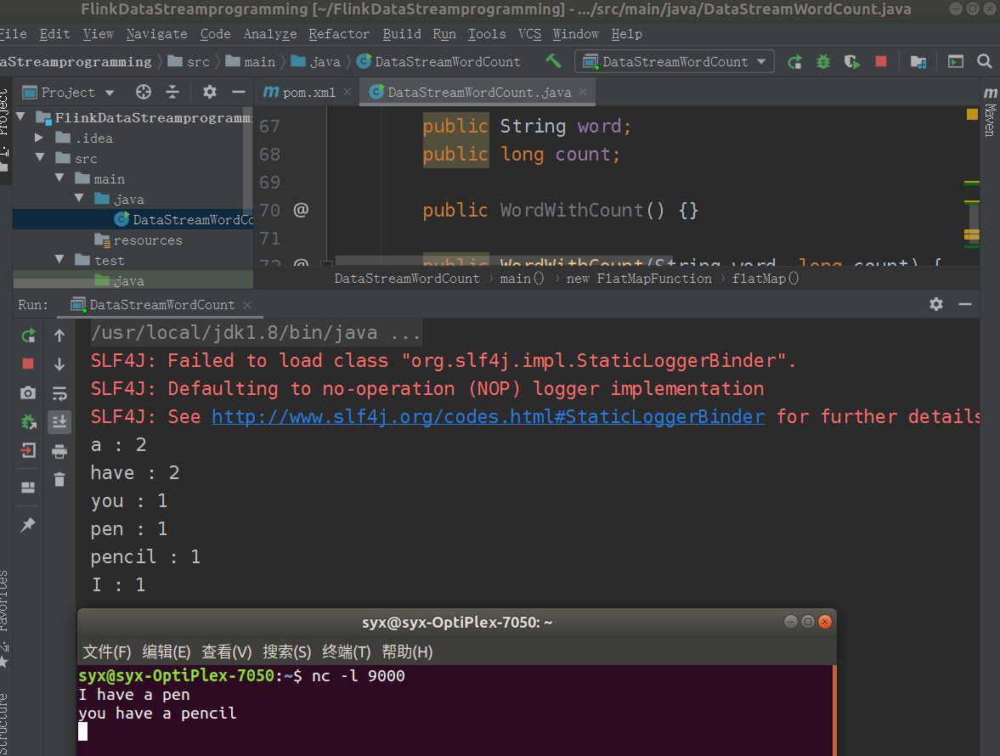
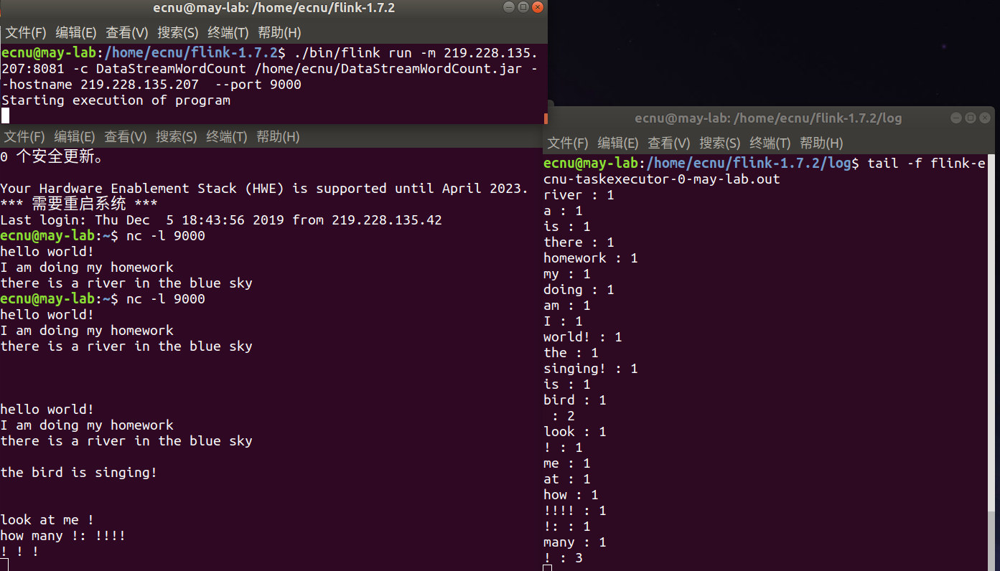

+ #### 新建Maven项目并添加pom依赖

+ #### IDE环境编写代码
    + 编写java代码，在src->main->java目录下新建名为DataStreamWordCount的Java类，并编写代码                                                                                                                           

# 2. 调试Flink程序
+ #### IDE中直接运行
    + 配置运行环境，并进行本地调试。在IntelliJ菜单栏中选择Run->Edit Configuration，在弹出对话框中新建Application配置，配置Main Class为DataStreamWordCount，Program arguments为hostname port，分别为主机名和端口号，默认主机名为localhost。如下图所示：
    +  
    
    + 配置完成后，右键->Run'DataStreamWordCount'
    
    - 输出：
    
      

+ #### 调试经验
    +  IDE中设置断点


+ #### 分布式模式下提交flink程序
    + 首先是上传jar包，执行scp命令将jar包上传至集群

      ```shell
      scp flinkprogram.jar ecnu@ip:/home/ecnu
      ```
    + 在client中输入命令,向集群中的jobmanager提交作业

      另起终端，在flink log目录下输入如下命令，查看结果.out, 如下所示： 

      

      

      


