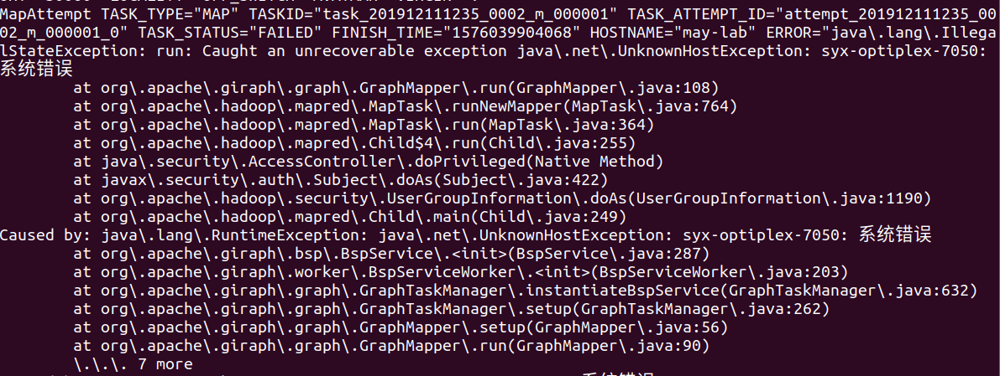
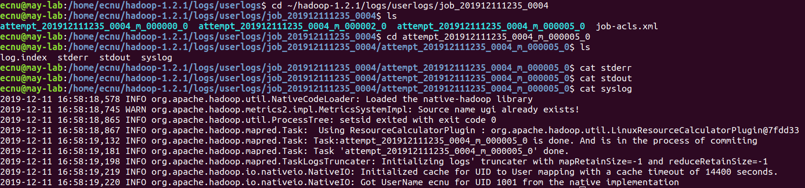

# 华东师范大学数据科学与工程学院实验报告

| **课程名称：分布式模型与编程**          | **年级：2017**       | **上机实践成绩**：                                       |
| --------------------------------------- | -------------------- | -------------------------------------------------------- |
| **指导教师**：**徐辰**                  | **姓名**：**熊双宇** | **学号**：**10174102103**                                |
| **上机实践名称**：**Giraph部署与编程** |                      | **上机实践日期**：**2019.12.04-2019.12.25【第15-16周】** |
| **上机实践编号：实验四**                | **组号**：**11**     | **上机实践时间**：**18:00-19:30**                        |

# 一. 实验目的

- 学习Giraph的部署，理解Giraph与MapReduce之间的关系
- 练习以顶点为中心的图算法编程方式，体会与基于MapReduce/Spark/Flink进行图算法编程的区别

# 二. 实验任务

- [Giraph部署]()【第15周】：单机集中式、单机伪分布式（在个人用户下独立完成）、分布式（多位同学新建一个相同的用户，例如ecnu，协作完成）
- [Giraph编程]()【第16周】

# 三. 使用环境

1. Ubuntu18.04
2. giraph-1.2.0
3. hadoop-1.2.1
4. mapreduce

# 四. 实验过程

## Giraph 基于 MapReduce v1 部署

## 1 单机集中式部署

如果 Hadoop 1.2.1 处于单机伪分布式状态, 可跳过该步直接进入单机伪分布式部署

## 2 单机伪分布式部署

### 2.1 准备工作

  **注意: 以下默认用户名为 `syx`, 请自行将所有的 `syx` 替换成实际的用户名**

  * 下载安装 Giraph: 以 `giraph-dist-1.2.0-bin.tar.gz` 为例

    ```shell
    cd ~/Downloads
    wget https://mirrors.tuna.tsinghua.edu.cn/apache/giraph/giraph-1.2.0/giraph-dist-1.2.0-bin.tar.gz
    tar -zxvf giraph-dist-1.2.0-bin.tar.gz
    mv ./giraph-1.2.0-for-hadoop-1.2.1 ~/giraph-1.2.0-for-hadoop-1.2.1
    ```

  * 完成 [MapReduce v1 单机伪分布式部署](../Hadoop Deployment/MapReduce v1-deployment.md#单机伪分布式部署)

### 2.2 修改配置

  * 修改 `~/giraph-1.2.0-for-hadoop-1.2.1/bin/giraph-env`, 指定 Hadoop 安装路径

    ```shell
    sed -i '1i\export HADOOP_HOME=~/hadoop-1.2.1' ~/giraph-1.2.0-for-hadoop-1.2.1/bin/giraph-env
    ```

  * 修改 `~/hadoop-1.2.1/conf/mapred-site.xml`, 在 `<configuration>` 下添加

    

### 2.3 启动 Hadoop

  * 启动 HDFS

    ```shell
    ~/hadoop-1.2.1/bin/start-dfs.sh
    ```

  * 启动 MapReduce

    ```shell
    ~/hadoop-1.2.1/bin/start-mapred.sh
    ```

### 2.4 运行 Giraph 应用程序

  Simple shortest paths computation 示例程序 

  * 将 `tiny_graph.txt` 上传至 `hdfs:///user/syx/input` 下

    ```shell
    ~/hadoop-1.2.1/bin/hadoop fs -mkdir input
    ~/hadoop-1.2.1/bin/hadoop fs -put ~/tiny_graph.txt input/
    ```

  * 执行程序

    

    此处指定 worker 数为 3

  * 查看运行中进程

    

    可见 Giraph 程序启动的进程和其它 MapReduce 程序的相同  
    此外在 Giraph 任务执行过程中, Hadoop JobTracker 会启动 `worker 数量 + 1` 个 map task,
    原因是其中一个 task 是 Giraph 的Master

  * 运行完成后查看输出

    

### 2.5 查看 Giraph 应用程序运行信息

  * 访问 JobTracker 网页 (http://localhost:50030)

    点击正在运行或已完成的 Giraph 应用程序, 可看到 Giraph 应用程序的统计信息  
    

    

    

  * 查看程序日志

    * JobHistory 日志默认位置: `~/hadoop-1.2.1/logs/history`

      

      

    * Task 日志默认位置: `~/hadoop-1.2.1/logs/userlogs/<jobid>/<attempt-id>`

      

      

### 2.6 关闭 Hadoop

  * 关闭 HDFS

    ```shell
    ~/hadoop-1.2.1/bin/stop-dfs.sh
    ```

  * 关闭 MapReduce

    ```shell
    ~/hadoop-1.2.1/bin/stop-mapred.sh
    ```

## 3. 分布式部署

### 3.1 准备工作

  单机伪分布式是部署在同学们现有的用户名 `you` 下, 大家名字是不相同的.
  但是分布式部署需要每个节点都用同一个名字. 以下使用用户名 `ecnu`

  * 有至少两台的服务器, 每台服务器上都有用于分布式部置的用户 `ecnu`

  * 在其中一台机器上下载安装 Giraph: 以 `giraph-dist-1.2.0-bin.tar.gz` 为例

    ```shell
    cd ~/Downloads
    wget https://mirrors.tuna.tsinghua.edu.cn/apache/giraph/giraph-1.2.0/giraph-dist-1.2.0-bin.tar.gz
    tar -zxvf giraph-dist-1.2.0-bin.tar.gz
    mv ./giraph-1.2.0-for-hadoop-1.2.1 ~/giraph-1.2.0-for-hadoop-1.2.1
    ```

  * 已完成 [MapReduce v1 分布式部署](../Hadoop Deployment/MapReduce v1-deployment.md#分布式部署)

### 3.2 修改配置

  * 修改 `~/giraph-1.2.0-for-hadoop-1.2.1/bin/giraph-env`, 指定 Hadoop 安装路径

    ```shell
    sed -i '1i\export HADOOP_HOME=~/hadoop-1.2.1' ~/giraph-1.2.0-for-hadoop-1.2.1/bin/giraph-env
    ```

### 3.3 启动 Hadoop

  * 启动 HDFS, 在主节点执行

    ```shell
    ~/hadoop-1.2.1/bin/start-dfs.sh
    ```

  * 启动 MapReduce, 在主节点执行

    ```shell
    ~/hadoop-1.2.1/bin/start-mapred.sh
    ```

* 

* 

### 3.4 运行 Giraph 应用程序

  Simple shortest paths computation 示例程序 ([官方说明](http://giraph.apache.org/quick_start.html))

  * 将 `tiny_graph.txt` 上传至 `hdfs:///user/ecnu/input` 下

    ```shell
    ~/hadoop-1.2.1/bin/hadoop fs -mkdir input
    ~/hadoop-1.2.1/bin/hadoop fs -put ~/tiny_graph.txt input/
    ```

  * 执行程序

  * 查看运行中进程

    * 主节点

    

    * 从节点

    

  * 运行完成后查看输出


## Giraph 应用编程实践

## 1. 编写Giraph程序

##### - 创建maven项目

参考文档：[create maven.md](/Create Maven Project/create maven.md)

##### - 添加pom依赖

在pom.xml文件中添加以下依赖：`giraph-core`、`giraph-examples`、`hadoop-common`和`hadoop-client`。  

##### - 编写Giraph应用程序代码

- 新建 `src/main/java/example/MaxVertexValue.java` 类
- 新建 `src/main/java/GiraphDemoRunner.java` 类

## 2. 调试Giraph程序

##### - 配置程序输入

在 `src/main/resources/input/` 路径下添加输入文件 `graph-data1.txt` 和 `tiny_graph.txt`。

**输入文件内容说明**： 文件使用了 `JsonLongDoubleFloatDoubleVertexInputFormat` 图数据输入格式，  
文件中每行内容格式为 `[source_id,source_value,[[dest_id, edge_value],...]]`

- `graph-data1.txt` 文件内容：

  

- `tiny_graph.txt` 文件内容：

  

##### - IDE中直接运行Giraph `MaxVertexValue` 应用程序

直接在 IDEA 中运行 `src/main/java/GiraphDemoRunner.java` 类，并查看输出结果。正常执行下，程序会产生 `src/main/resources/output/graph_maxValue` 文件夹，文件夹内包含程序输出内容。

- 程序输出内容：

  

  **输出文件内容说明**： 文件使用了 `IdWithValueTextOutputFormat` 输出格式，输出文件中每行内容格式为：`source_id value` 表示每个节点上记录的 图中所有节点的最大值 。

## 3. 运行Giraph程序

##### - 利用IDE打包jar文件

这里默认取名`giraph.jar`

##### - 伪分布式模式下运行Giraph `MaxVertexValue` 程序

- 安装部署好 基于MapReduce v1的 Giraph 系统  
  参考文档：[Giraph基于MapReduce v1的部署](/Giraph Deployment/giraph-hadoop1.md)

- 上传输入文件至 HDFS

  

- 运行 giraph 程序  
  在终端中运行如下命令：

  

- 查看输出结果
  执行命令, 输出结果如下：

  

# 五. 总结

1. 单机伪分布式: 

- 指定worker数量为3时, Hadoop Jobtracker 会启动3+1个child(map task)运行, 多出来的一个是Giraph的Master;

- 程序运行时, 

  可以看见reduce的num tasks为0, 是因为Giraph借用Mapreduce的框架, 但并没有调用map/reduce的函数接口

- userlogs日志查看:

  - 一个job对应的前4个attempt(0, 1, 2, 3)分别代表Master, worker0, worker1, worker2

  - attemp0:

    

  - attempt1, 2, 3:

    

- logs/history查看:
  - 可以看见4个task

2. 分布式部署:

   - 遇到的错误: 

     - 已解决: :happy:

       

       solution: 在`/etc/hosts`中加入主机名和IP地址

       

     - 未解决: :cry:

       jps后所有的进程都能启动, 但是task运行到50%卡住直至运行结束

       - webUI

         

         

       - logs/history:

         ```vim
         Meta VERSION="1" .
         Job JOBID="job_201912111235_0004" JOBNAME="Giraph: org\.apache\.giraph\.examples\.SimpleShortestPathsComputation" USER="ecnu" SUBMIT_TIME="1576054692590" JOBCONF="hdfs://219\.228\.135\.207:9000/home/ecnu/tmp-1\.2\.1/mapred/staging/ecnu/\.staging/job_201912111235_0004/job\.xml" VIEW_JOB="*" MODIFY_JOB="*" JOB_QUEUE="default" WORKFLOW_ID="" WORKFLOW_NAME="" WORKFLOW_NODE_NAME="" WORKFLOW_ADJACENCIES="" WORKFLOW_TAGS="" .
         Job JOBID="job_201912111235_0004" JOB_PRIORITY="NORMAL" .
         Job JOBID="job_201912111235_0004" LAUNCH_TIME="1576054692650" TOTAL_MAPS="4" TOTAL_REDUCES="0" JOB_STATUS="PREP" .
         Task TASKID="task_201912111235_0004_m_000005" TASK_TYPE="SETUP" START_TIME="1576054692671" SPLITS="" .
         MapAttempt TASK_TYPE="SETUP" TASKID="task_201912111235_0004_m_000005" TASK_ATTEMPT_ID="attempt_201912111235_0004_m_000005_0" START_TIME="1576054697910" TRACKER_NAME="tracker_may-lab:localhost/127\.0\.0\.1:40597" HTTP_PORT="50060" LOCALITY="OFF_SWITCH" AVATAAR="VIRGIN" .
         MapAttempt TASK_TYPE="SETUP" TASKID="task_201912111235_0004_m_000005" TASK_ATTEMPT_ID="attempt_201912111235_0004_m_000005_0" TASK_STATUS="SUCCESS" FINISH_TIME="1576054699181" HOSTNAME="/default-rack/may-lab" STATE_STRING="setup" COUNTERS="{(org\.apache\.hadoop\.mapred\.Task$Counter)(Map-Reduce Framework)[(SPILLED_RECORDS)(Spilled Records)(0)][(VIRTUAL_MEMORY_BYTES)(Virtual memory \\(bytes\\) snapshot)(578052096)][(PHYSICAL_MEMORY_BYTES)(Physical memory \\(bytes\\) snapshot)(122966016)][(CPU_MILLISECONDS)(CPU time spent \\(ms\\))(140)][(COMMITTED_HEAP_BYTES)(Total committed heap usage \\(bytes\\))(112459776)]}{(FileSystemCounters)(FileSystemCounters)[(FILE_BYTES_WRITTEN)(FILE_BYTES_WRITTEN)(123279)]}" .
         Task TASKID="task_201912111235_0004_m_000005" TASK_TYPE="SETUP" TASK_STATUS="SUCCESS" FINISH_TIME="1576054699290" COUNTERS="{(org\.apache\.hadoop\.mapred\.Task$Counter)(Map-Reduce Framework)[(SPILLED_RECORDS)(Spilled Records)(0)][(VIRTUAL_MEMORY_BYTES)(Virtual memory \\(bytes\\) snapshot)(578052096)][(PHYSICAL_MEMORY_BYTES)(Physical memory \\(bytes\\) snapshot)(122966016)][(CPU_MILLISECONDS)(CPU time spent \\(ms\\))(140)][(COMMITTED_HEAP_BYTES)(Total committed heap usage \\(bytes\\))(112459776)]}{(FileSystemCounters)(FileSystemCounters)[(FILE_BYTES_WRITTEN)(FILE_BYTES_WRITTEN)(123279)]}" .
         Job JOBID="job_201912111235_0004" JOB_STATUS="RUNNING" .
         Task TASKID="task_201912111235_0004_m_000000" TASK_TYPE="MAP" START_TIME="1576054699292" SPLITS="" .
         Task TASKID="task_201912111235_0004_m_000001" TASK_TYPE="MAP" START_TIME="1576054699422" SPLITS="" .
         Task TASKID="task_201912111235_0004_m_000002" TASK_TYPE="MAP" START_TIME="1576054699594" SPLITS="" .
         Task TASKID="task_201912111235_0004_m_000003" TASK_TYPE="MAP" START_TIME="1576054699724" SPLITS="" .
         Task TASKID="task_201912111235_0004_m_000004" TASK_TYPE="CLEANUP" START_TIME="1576055901549" SPLITS="" .
         MapAttempt TASK_TYPE="MAP" TASKID="task_201912111235_0004_m_000000" TASK_ATTEMPT_ID="attempt_201912111235_0004_m_000000_0" START_TIME="1576054699294" TRACKER_NAME="tracker_may-lab:localhost/127\.0\.0\.1:40597" HTTP_PORT="50060" LOCALITY="OFF_SWITCH" AVATAAR="VIRGIN" .
         MapAttempt TASK_TYPE="MAP" TASKID="task_201912111235_0004_m_000000" TASK_ATTEMPT_ID="attempt_201912111235_0004_m_000000_0" TASK_STATUS="KILLED" FINISH_TIME="1576055901684" HOSTNAME="may-lab" ERROR="" .
         MapAttempt TASK_TYPE="MAP" TASKID="task_201912111235_0004_m_000002" TASK_ATTEMPT_ID="attempt_201912111235_0004_m_000002_0" START_TIME="1576054699595" TRACKER_NAME="tracker_may-lab:localhost/127\.0\.0\.1:40597" HTTP_PORT="50060" LOCALITY="OFF_SWITCH" AVATAAR="VIRGIN" .
         MapAttempt TASK_TYPE="MAP" TASKID="task_201912111235_0004_m_000002" TASK_ATTEMPT_ID="attempt_201912111235_0004_m_000002_0" TASK_STATUS="KILLED" FINISH_TIME="1576055901691" HOSTNAME="may-lab" ERROR="" .
         MapAttempt TASK_TYPE="CLEANUP" TASKID="task_201912111235_0004_m_000004" TASK_ATTEMPT_ID="attempt_201912111235_0004_m_000004_0" START_TIME="1576055901544" TRACKER_NAME="tracker_syx-OptiPlex-7050:localhost/127\.0\.0\.1:41333" HTTP_PORT="50060" LOCALITY="OFF_SWITCH" AVATAAR="VIRGIN" .
         MapAttempt TASK_TYPE="CLEANUP" TASKID="task_201912111235_0004_m_000004" TASK_ATTEMPT_ID="attempt_201912111235_0004_m_000004_0" TASK_STATUS="SUCCESS" FINISH_TIME="1576055902756" HOSTNAME="/default-rack/syx-OptiPlex-7050" STATE_STRING="cleanup" COUNTERS="{(org\.apache\.hadoop\.mapred\.Task$Counter)(Map-Reduce Framework)[(SPILLED_RECORDS)(Spilled Records)(0)][(VIRTUAL_MEMORY_BYTES)(Virtual memory \\(bytes\\) snapshot)(1958236160)][(PHYSICAL_MEMORY_BYTES)(Physical memory \\(bytes\\) snapshot)(142905344)][(CPU_MILLISECONDS)(CPU time spent \\(ms\\))(230)][(COMMITTED_HEAP_BYTES)(Total committed heap usage \\(bytes\\))(153092096)]}{(FileSystemCounters)(FileSystemCounters)[(FILE_BYTES_WRITTEN)(FILE_BYTES_WRITTEN)(123285)]}" .
         Task TASKID="task_201912111235_0004_m_000004" TASK_TYPE="CLEANUP" TASK_STATUS="SUCCESS" FINISH_TIME="1576055903060" COUNTERS="{(org\.apache\.hadoop\.mapred\.Task$Counter)(Map-Reduce Framework)[(SPILLED_RECORDS)(Spilled Records)(0)][(VIRTUAL_MEMORY_BYTES)(Virtual memory \\(bytes\\) snapshot)(1958236160)][(PHYSICAL_MEMORY_BYTES)(Physical memory \\(bytes\\) snapshot)(142905344)][(CPU_MILLISECONDS)(CPU time spent \\(ms\\))(230)][(COMMITTED_HEAP_BYTES)(Total committed heap usage \\(bytes\\))(153092096)]}{(FileSystemCounters)(FileSystemCounters)[(FILE_BYTES_WRITTEN)(FILE_BYTES_WRITTEN)(123285)]}" .
         ```

       - output of master's userlog

         

       - output of shell after submitting task

         ```vim
         No HADOOP_CONF_DIR set, using /home/ecnu//hadoop-1.2.1/conf 
         Warning: $HADOOP_HOME is deprecated.
         
         19/12/11 16:58:07 INFO utils.ConfigurationUtils: No edge input format specified. Ensure your InputFormat does not require one.
         19/12/11 16:58:07 INFO utils.ConfigurationUtils: No edge output format specified. Ensure your OutputFormat does not require one.
         19/12/11 16:58:07 INFO job.GiraphJob: run: Since checkpointing is disabled (default), do not allow any task retries (setting mapred.map.max.attempts = 1, old value = 4)
         19/12/11 16:58:12 INFO job.GiraphJob: Tracking URL: http://219.228.135.207:50030/jobdetails.jsp?jobid=job_201912111235_0004
         19/12/11 16:58:12 INFO job.GiraphJob: Waiting for resources... Job will start only when it gets all 4 mappers
         19/12/11 16:58:54 INFO job.HaltApplicationUtils$DefaultHaltInstructionsWriter: writeHaltInstructions: To halt after next superstep execute: 'bin/halt-application --zkServer may-lab:22181 --zkNode /_hadoopBsp/job_201912111235_0004/_haltComputation'
         19/12/11 16:58:54 INFO mapred.JobClient: Running job: job_201912111235_0004
         19/12/11 16:58:55 INFO mapred.JobClient:  map 50% reduce 0%
         19/12/11 17:18:23 INFO mapred.JobClient: Job complete: job_201912111235_0004
         19/12/11 17:18:23 INFO mapred.JobClient: Counters: 5
         19/12/11 17:18:23 INFO mapred.JobClient:   Job Counters 
         19/12/11 17:18:23 INFO mapred.JobClient:     Launched map tasks=4
         19/12/11 17:18:23 INFO mapred.JobClient:     SLOTS_MILLIS_REDUCES=0
         19/12/11 17:18:23 INFO mapred.JobClient:     Total time spent by all reduces waiting after reserving slots (ms)=0
         19/12/11 17:18:23 INFO mapred.JobClient:     SLOTS_MILLIS_MAPS=2406969
         19/12/11 17:18:23 INFO mapred.JobClient:     Total time spent by all maps waiting after reserving slots (ms)=0
         ```

         

       

     