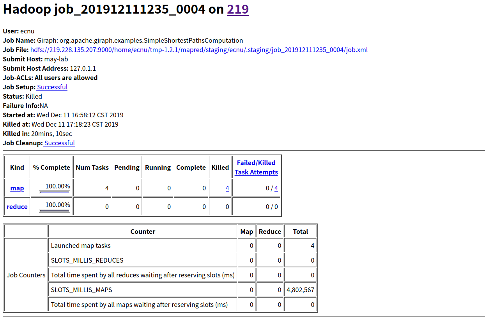

## 分布式部署:

### 3. 分布式部署

### 3.1 准备工作

  单机伪分布式是部署在同学们现有的用户名 `you` 下, 大家名字是不相同的.
  但是分布式部署需要每个节点都用同一个名字. 以下使用用户名 `ecnu`

  * 有至少两台的服务器, 每台服务器上都有用于分布式部置的用户 `ecnu`

  * 在其中一台机器上下载安装 Giraph: 以 `giraph-dist-1.2.0-bin.tar.gz` 为例

    ```shell
    cd ~/Downloads
    wget https://mirrors.tuna.tsinghua.edu.cn/apache/giraph/giraph-1.2.0/giraph-dist-1.2.0-bin.tar.gz
    tar -zxvf giraph-dist-1.2.0-bin.tar.gz
    mv ./giraph-1.2.0-for-hadoop-1.2.1 ~/giraph-1.2.0-for-hadoop-1.2.1
    ```

  * 已完成 [MapReduce v1 分布式部署](../Hadoop Deployment/MapReduce v1-deployment.md#分布式部署)

### 3.2 修改配置

  * 修改 `~/giraph-1.2.0-for-hadoop-1.2.1/bin/giraph-env`, 指定 Hadoop 安装路径

    ```shell
    sed -i '1i\export HADOOP_HOME=~/hadoop-1.2.1' ~/giraph-1.2.0-for-hadoop-1.2.1/bin/giraph-env
    ```

### 3.3 启动 Hadoop

  * 启动 HDFS, 在主节点执行

    ```shell
    ~/hadoop-1.2.1/bin/start-dfs.sh
    ```

  * 启动 MapReduce, 在主节点执行

    ```shell
    ~/hadoop-1.2.1/bin/start-mapred.sh
    ```

* 

* 

### 3.4 运行 Giraph 应用程序

  Simple shortest paths computation 示例程序 ([官方说明](http://giraph.apache.org/quick_start.html))

  * 将 `tiny_graph.txt` 上传至 `hdfs:///user/ecnu/input` 下

    ```shell
    ~/hadoop-1.2.1/bin/hadoop fs -mkdir input
    ~/hadoop-1.2.1/bin/hadoop fs -put ~/tiny_graph.txt input/
    ```

  * 执行程序

  * 查看运行中进程

    * 主节点

    

    * 从节点

    

  * 运行完成后查看输出

    


### 遇到的错误

- 遇到的错误: 

  - 已解决: :happy:

    

    solution: 在`/etc/hosts`中加入主机名和IP地址

    

  - 未解决: :cry:

    jps后所有的进程都能启动, 但是task运行到50%卡住直至运行结束

    - webUI

      

      

    - logs/history:

      ```vim
      Meta VERSION="1" .
      Job JOBID="job_201912111235_0004" JOBNAME="Giraph: org\.apache\.giraph\.examples\.SimpleShortestPathsComputation" USER="ecnu" SUBMIT_TIME="1576054692590" JOBCONF="hdfs://219\.228\.135\.207:9000/home/ecnu/tmp-1\.2\.1/mapred/staging/ecnu/\.staging/job_201912111235_0004/job\.xml" VIEW_JOB="*" MODIFY_JOB="*" JOB_QUEUE="default" WORKFLOW_ID="" WORKFLOW_NAME="" WORKFLOW_NODE_NAME="" WORKFLOW_ADJACENCIES="" WORKFLOW_TAGS="" .
      Job JOBID="job_201912111235_0004" JOB_PRIORITY="NORMAL" .
      Job JOBID="job_201912111235_0004" LAUNCH_TIME="1576054692650" TOTAL_MAPS="4" TOTAL_REDUCES="0" JOB_STATUS="PREP" .
      Task TASKID="task_201912111235_0004_m_000005" TASK_TYPE="SETUP" START_TIME="1576054692671" SPLITS="" .
      MapAttempt TASK_TYPE="SETUP" TASKID="task_201912111235_0004_m_000005" TASK_ATTEMPT_ID="attempt_201912111235_0004_m_000005_0" START_TIME="1576054697910" TRACKER_NAME="tracker_may-lab:localhost/127\.0\.0\.1:40597" HTTP_PORT="50060" LOCALITY="OFF_SWITCH" AVATAAR="VIRGIN" .
      MapAttempt TASK_TYPE="SETUP" TASKID="task_201912111235_0004_m_000005" TASK_ATTEMPT_ID="attempt_201912111235_0004_m_000005_0" TASK_STATUS="SUCCESS" FINISH_TIME="1576054699181" HOSTNAME="/default-rack/may-lab" STATE_STRING="setup" COUNTERS="{(org\.apache\.hadoop\.mapred\.Task$Counter)(Map-Reduce Framework)[(SPILLED_RECORDS)(Spilled Records)(0)][(VIRTUAL_MEMORY_BYTES)(Virtual memory \\(bytes\\) snapshot)(578052096)][(PHYSICAL_MEMORY_BYTES)(Physical memory \\(bytes\\) snapshot)(122966016)][(CPU_MILLISECONDS)(CPU time spent \\(ms\\))(140)][(COMMITTED_HEAP_BYTES)(Total committed heap usage \\(bytes\\))(112459776)]}{(FileSystemCounters)(FileSystemCounters)[(FILE_BYTES_WRITTEN)(FILE_BYTES_WRITTEN)(123279)]}" .
      Task TASKID="task_201912111235_0004_m_000005" TASK_TYPE="SETUP" TASK_STATUS="SUCCESS" FINISH_TIME="1576054699290" COUNTERS="{(org\.apache\.hadoop\.mapred\.Task$Counter)(Map-Reduce Framework)[(SPILLED_RECORDS)(Spilled Records)(0)][(VIRTUAL_MEMORY_BYTES)(Virtual memory \\(bytes\\) snapshot)(578052096)][(PHYSICAL_MEMORY_BYTES)(Physical memory \\(bytes\\) snapshot)(122966016)][(CPU_MILLISECONDS)(CPU time spent \\(ms\\))(140)][(COMMITTED_HEAP_BYTES)(Total committed heap usage \\(bytes\\))(112459776)]}{(FileSystemCounters)(FileSystemCounters)[(FILE_BYTES_WRITTEN)(FILE_BYTES_WRITTEN)(123279)]}" .
      Job JOBID="job_201912111235_0004" JOB_STATUS="RUNNING" .
      Task TASKID="task_201912111235_0004_m_000000" TASK_TYPE="MAP" START_TIME="1576054699292" SPLITS="" .
      Task TASKID="task_201912111235_0004_m_000001" TASK_TYPE="MAP" START_TIME="1576054699422" SPLITS="" .
      Task TASKID="task_201912111235_0004_m_000002" TASK_TYPE="MAP" START_TIME="1576054699594" SPLITS="" .
      Task TASKID="task_201912111235_0004_m_000003" TASK_TYPE="MAP" START_TIME="1576054699724" SPLITS="" .
      Task TASKID="task_201912111235_0004_m_000004" TASK_TYPE="CLEANUP" START_TIME="1576055901549" SPLITS="" .
      MapAttempt TASK_TYPE="MAP" TASKID="task_201912111235_0004_m_000000" TASK_ATTEMPT_ID="attempt_201912111235_0004_m_000000_0" START_TIME="1576054699294" TRACKER_NAME="tracker_may-lab:localhost/127\.0\.0\.1:40597" HTTP_PORT="50060" LOCALITY="OFF_SWITCH" AVATAAR="VIRGIN" .
      MapAttempt TASK_TYPE="MAP" TASKID="task_201912111235_0004_m_000000" TASK_ATTEMPT_ID="attempt_201912111235_0004_m_000000_0" TASK_STATUS="KILLED" FINISH_TIME="1576055901684" HOSTNAME="may-lab" ERROR="" .
      MapAttempt TASK_TYPE="MAP" TASKID="task_201912111235_0004_m_000002" TASK_ATTEMPT_ID="attempt_201912111235_0004_m_000002_0" START_TIME="1576054699595" TRACKER_NAME="tracker_may-lab:localhost/127\.0\.0\.1:40597" HTTP_PORT="50060" LOCALITY="OFF_SWITCH" AVATAAR="VIRGIN" .
      MapAttempt TASK_TYPE="MAP" TASKID="task_201912111235_0004_m_000002" TASK_ATTEMPT_ID="attempt_201912111235_0004_m_000002_0" TASK_STATUS="KILLED" FINISH_TIME="1576055901691" HOSTNAME="may-lab" ERROR="" .
      MapAttempt TASK_TYPE="CLEANUP" TASKID="task_201912111235_0004_m_000004" TASK_ATTEMPT_ID="attempt_201912111235_0004_m_000004_0" START_TIME="1576055901544" TRACKER_NAME="tracker_syx-OptiPlex-7050:localhost/127\.0\.0\.1:41333" HTTP_PORT="50060" LOCALITY="OFF_SWITCH" AVATAAR="VIRGIN" .
      MapAttempt TASK_TYPE="CLEANUP" TASKID="task_201912111235_0004_m_000004" TASK_ATTEMPT_ID="attempt_201912111235_0004_m_000004_0" TASK_STATUS="SUCCESS" FINISH_TIME="1576055902756" HOSTNAME="/default-rack/syx-OptiPlex-7050" STATE_STRING="cleanup" COUNTERS="{(org\.apache\.hadoop\.mapred\.Task$Counter)(Map-Reduce Framework)[(SPILLED_RECORDS)(Spilled Records)(0)][(VIRTUAL_MEMORY_BYTES)(Virtual memory \\(bytes\\) snapshot)(1958236160)][(PHYSICAL_MEMORY_BYTES)(Physical memory \\(bytes\\) snapshot)(142905344)][(CPU_MILLISECONDS)(CPU time spent \\(ms\\))(230)][(COMMITTED_HEAP_BYTES)(Total committed heap usage \\(bytes\\))(153092096)]}{(FileSystemCounters)(FileSystemCounters)[(FILE_BYTES_WRITTEN)(FILE_BYTES_WRITTEN)(123285)]}" .
      Task TASKID="task_201912111235_0004_m_000004" TASK_TYPE="CLEANUP" TASK_STATUS="SUCCESS" FINISH_TIME="1576055903060" COUNTERS="{(org\.apache\.hadoop\.mapred\.Task$Counter)(Map-Reduce Framework)[(SPILLED_RECORDS)(Spilled Records)(0)][(VIRTUAL_MEMORY_BYTES)(Virtual memory \\(bytes\\) snapshot)(1958236160)][(PHYSICAL_MEMORY_BYTES)(Physical memory \\(bytes\\) snapshot)(142905344)][(CPU_MILLISECONDS)(CPU time spent \\(ms\\))(230)][(COMMITTED_HEAP_BYTES)(Total committed heap usage \\(bytes\\))(153092096)]}{(FileSystemCounters)(FileSystemCounters)[(FILE_BYTES_WRITTEN)(FILE_BYTES_WRITTEN)(123285)]}" .
      ```

    - output of master's userlog

      

    - output of shell after submitting task

      ```vim
      No HADOOP_CONF_DIR set, using /home/ecnu//hadoop-1.2.1/conf 
      Warning: $HADOOP_HOME is deprecated.
      
      19/12/11 16:58:07 INFO utils.ConfigurationUtils: No edge input format specified. Ensure your InputFormat does not require one.
      19/12/11 16:58:07 INFO utils.ConfigurationUtils: No edge output format specified. Ensure your OutputFormat does not require one.
      19/12/11 16:58:07 INFO job.GiraphJob: run: Since checkpointing is disabled (default), do not allow any task retries (setting mapred.map.max.attempts = 1, old value = 4)
      19/12/11 16:58:12 INFO job.GiraphJob: Tracking URL: http://219.228.135.207:50030/jobdetails.jsp?jobid=job_201912111235_0004
      19/12/11 16:58:12 INFO job.GiraphJob: Waiting for resources... Job will start only when it gets all 4 mappers
      19/12/11 16:58:54 INFO job.HaltApplicationUtils$DefaultHaltInstructionsWriter: writeHaltInstructions: To halt after next superstep execute: 'bin/halt-application --zkServer may-lab:22181 --zkNode /_hadoopBsp/job_201912111235_0004/_haltComputation'
      19/12/11 16:58:54 INFO mapred.JobClient: Running job: job_201912111235_0004
      19/12/11 16:58:55 INFO mapred.JobClient:  map 50% reduce 0%
      19/12/11 17:18:23 INFO mapred.JobClient: Job complete: job_201912111235_0004
      19/12/11 17:18:23 INFO mapred.JobClient: Counters: 5
      19/12/11 17:18:23 INFO mapred.JobClient:   Job Counters 
      19/12/11 17:18:23 INFO mapred.JobClient:     Launched map tasks=4
      19/12/11 17:18:23 INFO mapred.JobClient:     SLOTS_MILLIS_REDUCES=0
      19/12/11 17:18:23 INFO mapred.JobClient:     Total time spent by all reduces waiting after reserving slots (ms)=0
      19/12/11 17:18:23 INFO mapred.JobClient:     SLOTS_MILLIS_MAPS=2406969
      19/12/11 17:18:23 INFO mapred.JobClient:     Total time spent by all maps waiting after reserving slots (ms)=0
      ```

      

    

  