# 华东师范大学数据科学与工程学院实验报告

| **课程名称**：分布式模型与编程         | **年级**：2017       | **上机实践成绩**：                         |
| -------------------------------------- | -------------------- | :----------------------------------------- |
| **指导教师**：**徐辰**                 | **姓名**：**熊双宇** | **学号**：**10174102103**                  |
| **上机实践名称**：**Hadoop部署与编程** |                      | **上机实践日期**：**2019.9.20-2019.10.17** |
| **上机实践编号**：**实验1**            | **组号**：**11**     | **上机实践时间**：**18:00-19:30**          |

## **一. 实验目的**

1. 学习Hadoop v1和Hadoop v2的部署，理解单机集中式、单机伪分布式的区别;
2. 学会通过系统日志查找部署和编程中遇到的错误;
3. 通过系统部署理解Hadoop的体系架构，以及Hadoop v1和Hadoop v2之间的差异，初步体会Yarn的作用;
4. 学习基于Hadoop v2 API的编程，包括HDFS和MapReduce;
5. 了解Hadoop Streaming编程

## **二. 实验任务**

1. HDFS 1.0部署【第3周】: 单机伪分布式（在个人用户下独立完成）、分布式（多位同学新建一个相同的用户，例如ecnu，协作完成）
2. MapReduce 1.0部署【第3周】: 单机集中式、单机伪分布式（在个人用户下独立完成）、分布式（多位同学新建一个相同的用户，例如ecnu，协作完成）
3. HDFS 2.0部署【第4周】: 单机伪分布式（在个人用户下独立完成）、分布式（多位同学新建一个相同的用户，例如ecnu，协作完成）
4. MapReduce 2.0部署【第4周】: 单机集中式、单机伪分布式（在个人用户下独立完成）、分布式（多位同学新建一个相同的用户，例如ecnu，协作完成）
5. HDFS编程【第5周】
6. MapReduce编程【第6周】
7. Hadoop Streaming编程【第6周】：该内容选做

##三. 使用环境

1. Ubuntu18.04
2. hadoop-1.2.1
3. hadoop-2.9.2

## 四. 实验过程

### 1. HDFS v1部署

**1.1 启动HDFS: `~/hadoop-1.2.1/bin/start-dfs.sh`, 使用jps查看启动后的进程**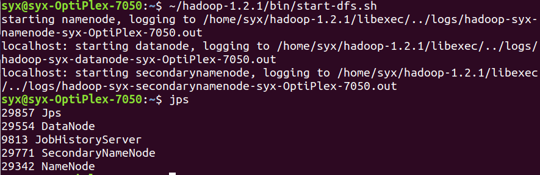

**1.2 查看HDFS服务信息**

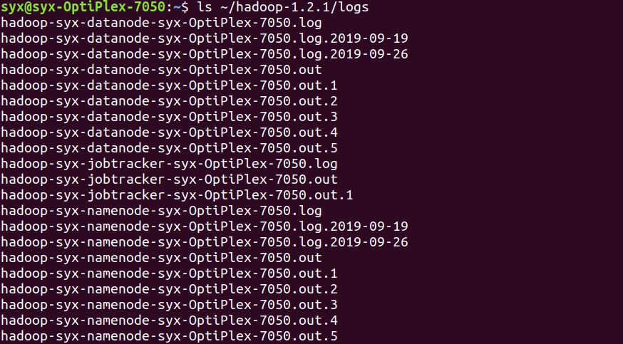

**1.3 常用的HDFS Shell命令**

**1.3.1 directory**

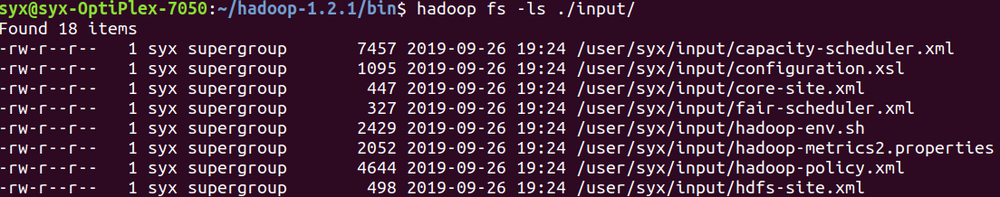

**1.3.2 file**

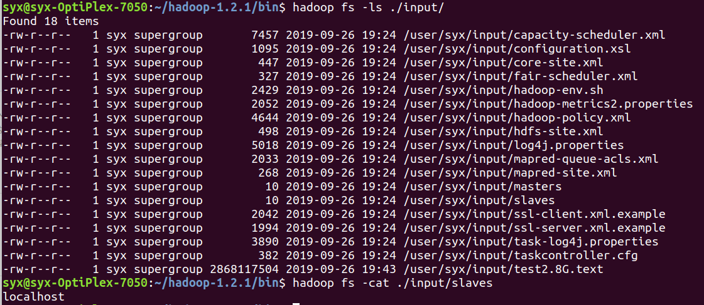

**1.4 停止HDFS服务**


### 2. MapReduce v1部署

**2.1单机集中式部署**

**2.1.1 启动MapReduce服务**

- 查看进程，验证是否成功启动服务 

**2.1.2  提交MapReduce应用程序**

- 提交jar命令并查看运行结果, 运行grep示例：

  

**2.1.3 查看运行过程中的进程**

- 运行 wordcount 示例，并且查看系统执行该任务过程中启动的进程：

  


**2.2 单机伪分布式部署**

**2.2.1 启动MapReduce服务**

- `~/hadoop-1.2.1/bin/start-mapred.sh`

- `~/hadoop-1.2.1/bin/start-dfs.sh`

  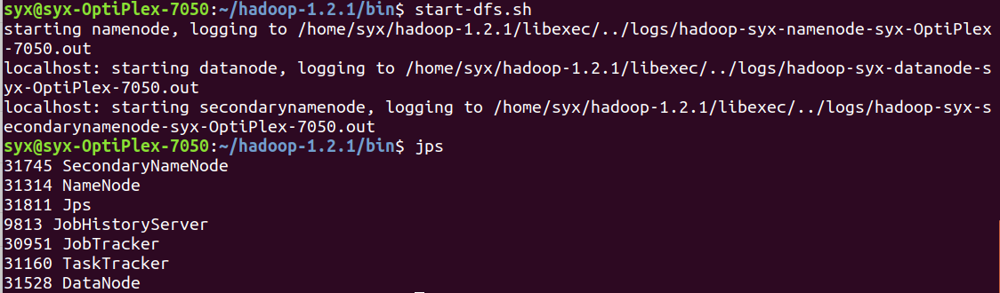

**2.3 停止MapReduce服务**

**2.3.1 停止命令 **

- 使用jps查看进程，不再出现NameNode、SecondaryNameNode、DataNode、JobTracker、TaskTracker等进程则服务停止

  


### 3.  HDFS v2部署

**3.1 单机伪分布式部署**

**3.1.1 HDFS 服务**

-  启动, `jps` 查看 HDFS 进程. 若出现 NameNode, DataNode, SecondaryNameNode, 则表示启动成功

  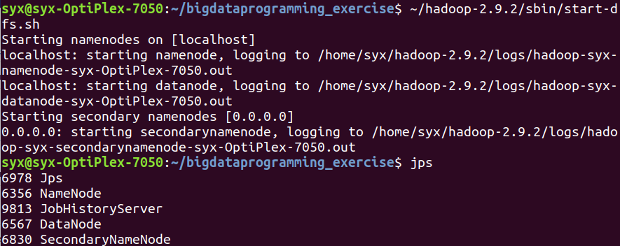

- 停止, 使用 jps 查看进程, 不再出现 NameNode, DataNode, SecondaryNameNode 则表示服务停止

  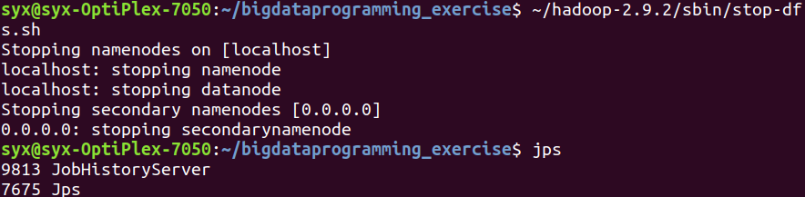

  ​

### 4. MapReduce v2 部署

**4.1 单机集中式部署**

**4.1.1 启动MapReduce服务**

- 启动YARN命令

- 开启历史服务器

- 启动HDFS服务

- `jps`

  


**4.1.2 运行MapReduce应用程序**

- 提交jar命令并查看运行结果, 运行grep示例, 结果如下：

   

   

- 运行 wordcount 示例

  

### 5.HDFS 应用编程实践 

**5.1 使用IntelliJ IDEA编写 测试HDFS中是否存在一个文件 应用程序**

**5.1.1运行 `测试HDFS中是否存在一个文件` 应用程序 HDFSFileExist: **

-  
-  

**5.2  列出目录下所有文件 ListHDFSFile:** 

-  
-  

**5.3 写入文件 WriteHDFSFIle**

-  
-  

**5.4 读取文件 ReadHDFSFile**

-  
-   


### 6. Hadoop Straming 介绍与实践

**6.1使用 C++ 编写 Mapper/Reducer 源文件, 脚本测试 **

-  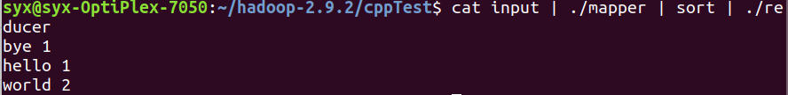

**6.2 使用 Hadoop Streaming 运行**

**6.2.1 伪分布式或分布式部署时**

-  输出结果和脚本测试结果相同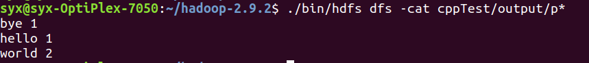

**6.3 Hadoop Streaming Shell 示例**

**6.3.1 使用 Shell 编写 Mapper/Reducer 源文件, 脚本测试**

- 使用 Shell 编写 Mapper 和 Reducer, 实现 wordcount

- 编写输入文件 vi ~/hadoop-2.9.2/shellTest/input

  `hello world`

  `bye world`

- 使用脚本测试

  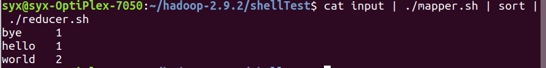

**6.3.2 使用 Hadoop Streaming 运行**

- 伪分布式或分布式部署时

  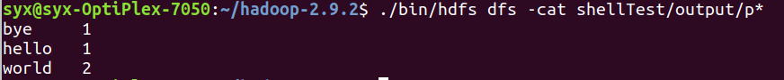


### 7. HDFS v2分布式部署

**7.1 准备工作**

**7.1.1 ssh 免密登陆多个不同节点**

- 验证三台机器是否彼此之间都可以免密登录，在每台机器上执行下面命令，如果没有出现需要输入密码的情况，则配置成功。

-   从节点免密登陆主节点

    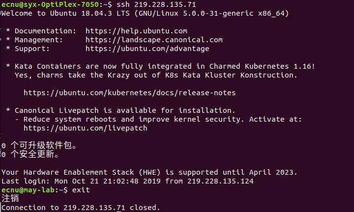

-   主节点免密登陆从节点 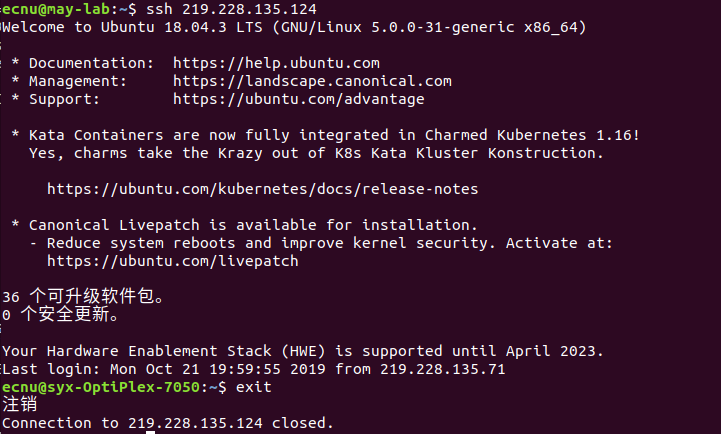

**7.2 部署 HDFS 服务**

**7.2.1 格式化 NameNode **

- 在主节点的 ecnu 用户下执行以下命令: `~/hadoop-2.9.2/bin/hdfs namenode -format`格式化 NameNode (不可反复执行, 重新格式化时必须删除 /home/you/hadoop-2.9.2/tmp)

- 通过scp将hadoop-2.9.2文件传输给从节点: ` scp -r ~/hadoop-2.9.2 ecnu@219.228.135.124:/home/ecnu`

   

**7.2.2 启动 HDFS 服务 **

在主节点的 `ecnu` 用户下执行以下命令:

```shell
~/hadoop-2.9.2/sbin/start-dfs.sh
```

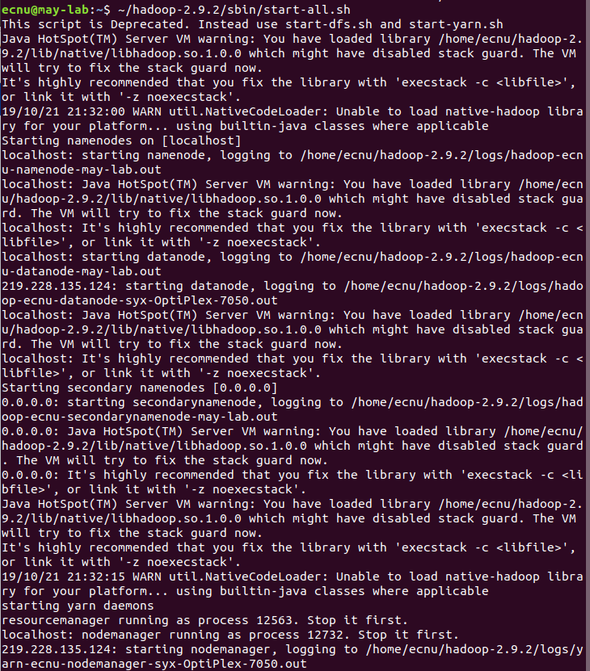

**7.3 查看 HDFS 服务信息**

**7.3.1 查看服务进程**

- 主节点上执行 jps

  

- 从节点上执行 jps

  

  ​

**7.4 停止 HDFS 服务**

**7.4.1 关闭 HDFS**

- 主节点上执行`~/hadoop-2.9.2/sbin/stop-dfs.sh`

- 使用 jps 在主节点和从节点查看进程, 不再出现 NameNode, DataNode, SecondaryNameNode 则表示服务停止 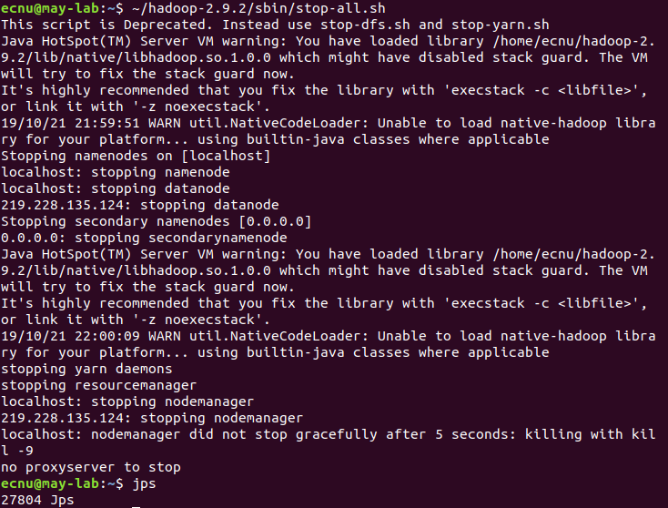

   

## 五. 总结

1. 无法put，报错：target　/conf ./bin/hadoop fs -ls 和ls不同，在hadoop的fs进行文件操作和在本地文件夹进行文件操作不同，所以能看到的文件是不同的

   

   solu:

   

   hadoop's FS is different from linux's FS.  I have tried 

   ```linux
   sudo rm -rf /user/syx/input
   ```

   but this "input" is not the one in the hadoop FS.

2. Ignore the upper-case of the file name

   

   the correct name of class is : ListHDFSFile

3. 部署分布式时，遇到以下几个问题：

   - 环境没有配置好：

     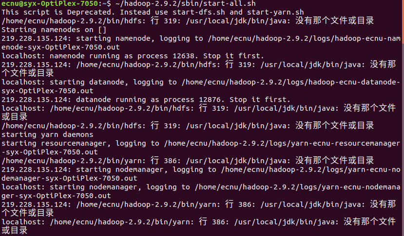

   - 解决：安装好环境

   - sudo用户中的ＨＤＦＳ没有停止服务，导致Ｄatanode和Nodemanager端口被占用，报错`java.net.BindException:Address already in use`

     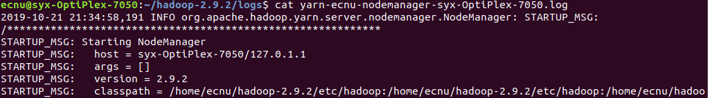

     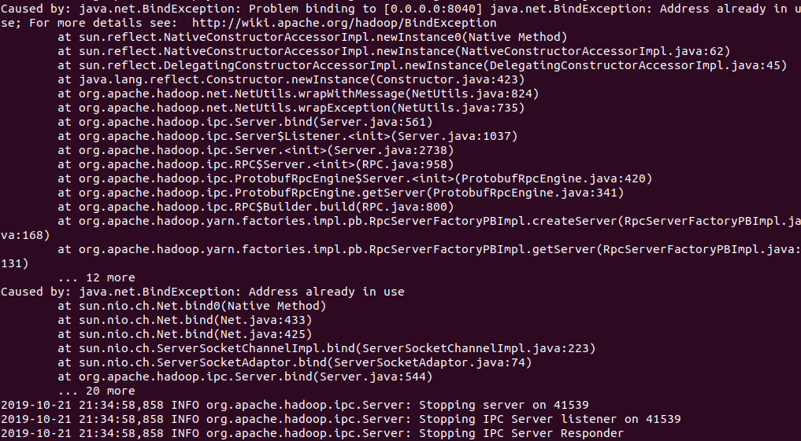

     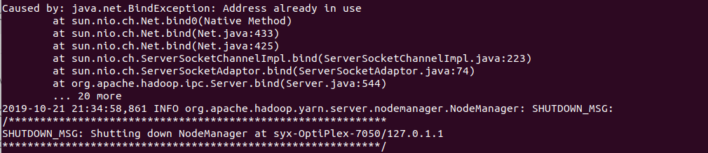

   - 解决：

   - - 用kill停止被占用的端口正在进行的服务 

   - 将hadoop文件从主节点拷贝至从节点，无法用Ｕ盘

   - 解决：使用scp，利用ＩＰ地址在不同电脑之间传递文件

4. 每次用input前，都需要删除output;

4. 按照实验步骤做时，要理解每一步的含义，注意warn提示，方便debug;

5. 分布式集群部署还需要时间;